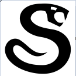

# Игра snake
Игра Змейка, вы управляете змеем окоянным и должны собирать яблоки.

При сборе яблока, змей увеличивается в длине. При столкновении с краем экрана или своим хвостом, змей умирает и игра оканчивается. \
Цель игры: набрать максимальное кол-во очков(яблок)

При запуске игры, сначала показывается подсказка к управлению. Чтобы закрыть её и перейти к игре надо нажать Space.

    Управление:
     wasd - движение по прямой
     qezc - движение наискосок
     x - остановиться
     Space - перезапустить
     Esc/Alt+F4 - закрыть игру

#### Инструкция по запуску
 Запустить файл snake.exe \
или \
 С помощью Python(3.12.8 - рекомендуется) выполнить файл snake.py 
